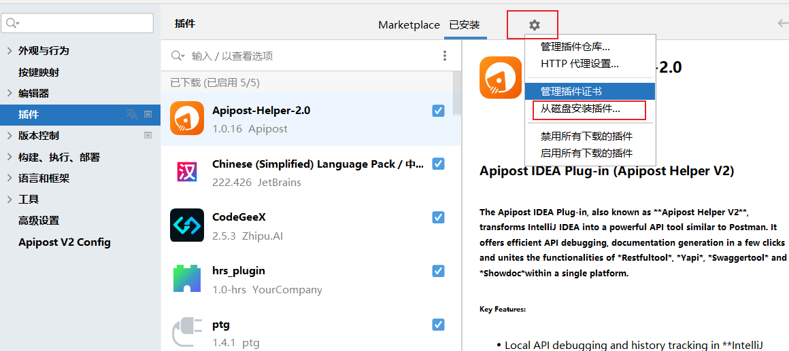

本插件可以用于jetbrains的编译器中
### 可以用于使用快捷键快速替换重复工作的内容

比如文本中原内容为 aaa
我想要通过快捷键ctrl+0其替换成 (test, aaa);

### 实现步骤
1. 通过在com.example.plugin添加一个java类CustomTextAction0
2. 在plugin.xml中的actions中添加
```text
      <action id="CustomTextAction0" class="com.example.plugin.CustomTextAction0" text="Custom Text Action" description="A custom text action.">
            <keyboard-shortcut keymap="$default" first-keystroke="control 0"/>
      </action>
```
3. 然后build之后，可以在插件
4. 

